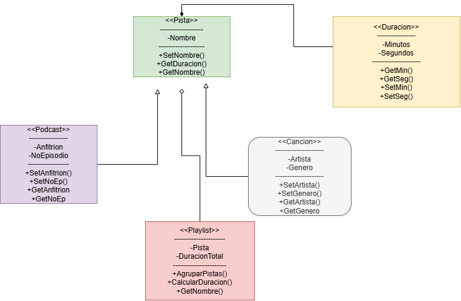

# Práctica 1: Playlist de música

Programación Orientada a Objetos · Ingeniería Mecatrónica · Tercer semestre

Llena cada espacio conforme avances en las fases de [PRACTICA.md](PRACTICA.md).

## Fase 1. Entender el problema

**1.1 El problema con mis propias palabras**

El reto es hacer una aplicacion de musica que maneje (canciones) y (podcast) en (playlist), donde cada (pista)  tiene (duracion) y titulo. La cancion tiene artistas y genero, mientras que los podcast tienen anfitrion y numero de episodio. Finalmente la playlist reúne pistas que ya existen en la biblioteca y reporta su duración total.

**1.2 Sustantivos (posibles clases) y verbos (posibles métodos)**

Sustantivos: 5

Verbos: 6

agregarCancion(), agregarPodcast(), totalSegundos(), mostrar(), mostrarInfo(), imprimir().

**1.3 Relaciones** (completa con "es un", "tiene un" o "usa un")

*   Una canción es una pista.
*   Un podcast es una pista.
*   Una pista tiene una duración.
*   Una playlist tiene una canción.

## Fase 2. Diseñar la solución

**2.1 Diagrama de clases**

**Pista es la clase base mientras que cancion y podcast son clase derivadas (Herencia). Por otro lado, duracion es una clase composicion de Pista y Playlist es una clase de agregacion de Pista.

**2.2 Justificación de cada relación**

| Relación | Tipo | ¿Por qué? |
| --- | --- | --- |
| Cancion - Pista | Herencia | Una cancion es una pista, cancion hereda los atributos de Pista y defines sus propios. |
| Podcast - Pista | Herencia | Un podcast es una pista, podcast hereda los atributos de Pista, y defines sus propios. |
| Pista - Duracion | Composicion | Una pista tiene una duracion y pista obtiene ese valor con la relacion de duracion.|
| Playlist - Cancion | Indirecta | No estan conectadas directamente porque Playlist no necesita saber sobre Cancion. |
| Playlist - Podcast | Indirecta |Una playlist agrupa punteros a pistas que viven de forma externa. |

## Fase 3. Implementar

**3.1 Bitácora de dudas**

| # | Duda | Cómo la resolví | Fuente |
| --- | --- | --- | --- |
| 1 | sintaxis en archivos .h | Con el prompt de E-R-A fui aprendiendo y corrigiendo hasta que los errores fueran borrandose. | Gemini |
| 2 | Sintaxis en archivos .cpp | Con el prompt de E-R-A fui aprendiendo y corrigiendo hasta que los errores fueran borrandose. | Gemini |
| 3 | Relacion entre Clases | Con el prompt de G-P-A la IA me fue guiando y preguntando hasta que por mi cuenta pudiera establecer las relaciones correctas| Gemini. |

**3.2 Experimentos guiados**

Experimento 1, orden de construcción y destrucción: 1.-Duracion 2.-Pista 3.-Cancion y el orden de destrucción es: 1.-Cancion 2.-Pista 3.-Duracion.

Experimento 2, ¿quién es dueño de quién?: En esta relacion no hay dueño absoluto ya que es un tipo indirecto de relacion, cancion vive dentro del main y mantiene su propia vida.

Experimento 3, un objeto en dos playlists: El ampersand (&) actúa como el operador de dirección para extraer la ubicación de la canción en el main, mientras que el asterisco (*) actúa en la firma del método como un puntero diseñado para recibir y almacenar dicha dirección.

## Fase 4. Probar y mejorar

**4.1 Tabla de pruebas**

| # | Caso | Resultado esperado | Resultado obtenido | ¿Pasa? |
| --- | --- | --- | --- | --- |
| 1 | Duración normal `Duracion(3, 45)` | 3:45 | 3:45 | si |
| 2 | Segundos mayores a 59 `Duracion(0, 75)` | 1:15 | 1:15 | si |
| 3 | Valores negativos `Duracion(-2, 10)` | 0:00 | 0:00 | si |
| 4 | Título vacío | "Sin título" | Sin titulo | si |
| 5 | Playlist vacía | 0:00 y 0 pistas | 0:00 y 0 | si |
| 6 | Canción duplicada | La segunda vez devuelve `false` | Solo reconoce la primera | si |
| 7 | Puntero nulo | Devuelve `false` | Las canciones estan vacias | si |
| 8 | Total con 2 canciones y 1 podcast | Suma correcta en m:ss | Suma correcta | si |

**4.2 Bitácora de mejoras**

| # | Falla o mejora detectada | Qué cambié | Por qué |
| --- | --- | --- | --- |
| 1 |  Validador de espacio en titulo | Agrege una validacion de espacios en Pista.  | Si hay una entrada vacia y con espacios en el titulo no la valida.
| 2 | Limite de Tiempo | Agrege un validador de tiempo en duracion. | Como metodo de control agrege un tope de minutos para podcast y cancion para delimitar la duracion. |

Retos opcionales que intenté: Una buena mejora podria ser categorizar alfabeticamente las pistas en la playlist.

## Fase 5. Publicar en GitHub

**5.1 Enlace a mi fork**

[(https://github.com/Jorge-Sadurni/ulsa_ime_3_poo_playlist/blob/main/README.md)]

## Cierre y reflexión

**6.1 ¿Qué aprendiste en esta práctica?**

En esta practica aprendi sobre las diferentes relaciones que hay, asi como se heredan sus atributos y metodos para poder reciclar 
codigo significativamente y hcaer un sistema mucho mas dinamico. Por otro lado, aprendi mas sobre la sintaxis en Programacion 
Orientada a Objetos en los archivos .h y .cpp. Finalmente aprendi a llevar al codigo a sus fallas y poder resolverlas y mejorarlas.

**6.2 ¿Qué cambiarías de tu proceso la próxima vez?*

Esperaria ser mas capaz y tener la hablidad de tener los suficientes conocimientos de sintaxis para que el proceso sea mucho mas fluido.